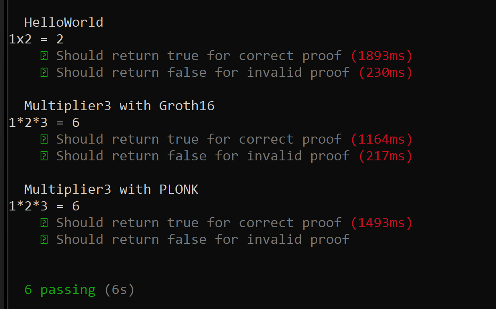
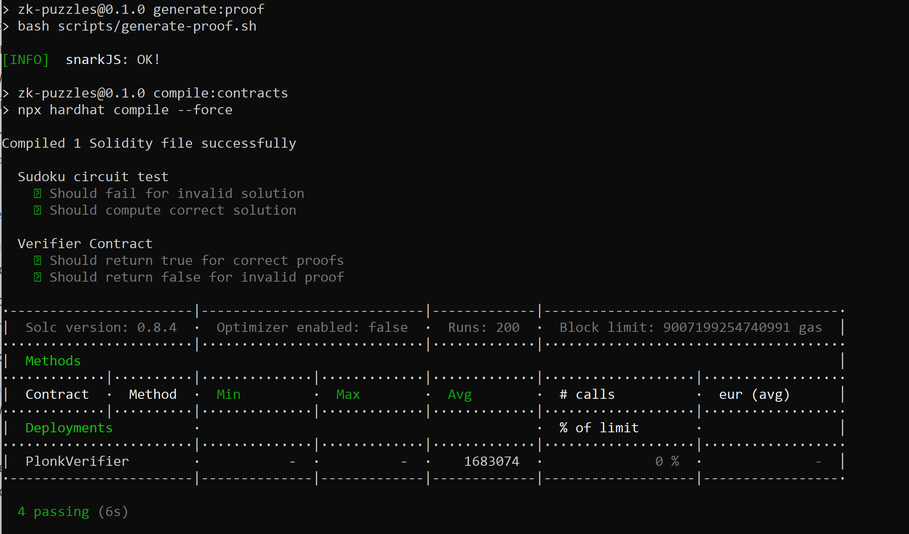

**Attribution:** The accompanying solutions were authored by **Marcos A. B.** His GitHub username is [codesport](https://github.com/codesport/).

#  Part 1 Theoretical background of zk-SNARKs and zk-STARKS

1. Groth16 and Plonk are 2 types of SNARk proofs.  A trusted setup ceremony is needed for SNARKs due to the private nature of the witness and the protection of the keys needed to be generated.

   Unlike Groth16, the trusted setup for PLONK is not circuit specific. This means a generic and universal trusted  setup is sufficient for PLONK.

   According to the Iden3 documentation(1), 
   
   >Groth16 requires a trusted ceremony for each circuit. PLONK does not require it, it's enough with the powers of tau ceremony which is universal.

    **(1)Source:** https://github.com/iden3/snarkjs#15-setup

2. According to Consenys(2), the keys are:

   >... used to create the proofs required for private transactions and the verification of those proofs

   **(2)Source:** https://consensys.net/blog/blockchain-explained/zero-knowledge-proofs-starks-vs-snarks

3. Two types of ZKs are SNARKs and STARKs. STARKS do not use a trusted set up because they rely on hashes.  For this reason they are also quantum resistant. Additional differences  between these two types of ZKs (as highlighted in the Consenys article above) include:

    * SNARKs are better documented
    * Use less gas due to smaller proof size
    * SNARKS are faster. That is, Time(Proof + Verification)SNARKs  < Time(Proof + Verification)STARKs

   Further discussion may be found here: https://discord.com/channels/942318442340560917/969583081310806116/971599434452467753

#  Part 2 Getting started with circom and snarkjs

## 2.2.1. What does the circuit in HelloWorld.circom do?

It multiplies 2 private inputs (a  and b) to produce an output called c. The constraints describe how to produce the output where c <== a * b; is a “compound” statement that is an assignment `(c <-- a * b)`  and an equality constraint `(c === a * b)`.

According to the iden docs(3), 
>... we’re using <== to connect c to a and b and at the same time constrain c to be the value of a*b.

**(3)Source:** https://blog.iden3.io/first-zk-proof.html

## 2.2.2 What is a Powers of Tau ceremony? Explain why this is important in the setup of zk-SNARK applications.

The goal of the Powers of Tau ceremony is to securely generate a Common Reference String (CRS) based on computations by multiple non-affiliated (i.e. decentralized) entities to prevent collusion.

According to ebfull(4) the Powers of Tau ceremony is a: 

>multi-party computation (MPC) ceremony which constructs partial zk-SNARK parameters for all circuits... It works by taking a step that is performed by all zk-SNARK MPCs and performing it in just one single ceremony. This makes individual zk-SNARK MPCs much cheaper and allows them to scale to practically unbounded numbers of participants.

**(4)Source:**  https://github.com/ebfull/powersoftau

## 2.2.3 How are Phase 1 and Phase 2 trusted setup ceremonies different from each other?

Phase 1 entails a universal ceremony using the powers of tau file. The Powers of Tau file was created using entropy.   Phase 2 entails one or more contributions which include random text and degrees of entropy (i.e., a random entropy contribution) as observed in steps 16 - 18 in iden’s zkSNARK README here: https://github.com/iden3/snarkjs#16-contribute-to-the-phase-2-ceremony

According to zkproof.org(5):

>The first phase referred to as "Powers of Tau", produces generic setup parameters that can be used for all circuits of the scheme, up to a given size. The second phase converts the output of the Powers of Tau phase into an NP-relation-specific CRS.  

**(5)Source:** https://zkproof.org/2021/06/30/setup-ceremonies/

Additional info on NP Relation from Britanica(6): 

>A problem is called NP (nondeterministic polynomial) if its solution can be guessed and verified in polynomial time

**(6)Source:** https://www.britannica.com/science/NP-complete-problem

According to a lecture by Luca Travison at Stanford(7), 
> a search problem defined by a relation R is a NP search problem if the relation is efficiently computable and such that solutions, if they exist, are short.

**(7)Source:** https://cs.stanford.edu/people/trevisan/cs254-12/lecture02.pdf
 

## 2.3.1 Try to run compile-Multiplier3-Groth16.sh. You should encounter an error with the circuit as is. Explain what the error means and how it arises.
 
This error arises because the constraint d <== a * b * c is not quadratic(8). 
**(8)Source:** https://docs.circom.io/circom-language/constraint-generation
 
## 2.3.2  How is the process of compiling with PLONK different from compiling with Groth16? 
 
With PLONK we start a new key by using
 
* the plonk keyword instead of the Groth16 keyword.
* circuit_final.zkey instead of circuit_0000.zkey

Additionally we exclude "making a contribution". Specifically, the following (Phase 2 step) is no longer needed: 
 
`snarkjs zkey contribute Multiplier3/circuit_0000.zkey Multiplier3/circuit_final.zkey --name="1st Contributor Name" -v -e="random text"`
 
##  Part 2 Q4, 2 (2.4.1) What are the practical differences between Groth16 and PLONK?

For the same Multiplier3.circom file, the resulting solidity contract for PLONK was 24kb vs 12 kb for Groth16.  A smaller solidity contract should result in lower gas fees.

Additionally, in terms of compile time, a manual stopwatch observation showed PLONK to be 1.9 seconds faster than Groth16 (3.7 seconds for PLONK vs 5.6 for Groth16). 

However, unit test from of the same contract showed Groth16 to be faster for truthy testing by 329 ms (1164 ms for Groth16 vs 1493 ms for PLONK)

## 2.5.3  Screenshot of all the tests (for HelloWorld, Multiplier3 with Groth16, and Multiplier3 with PLONK)

**Figure 1: Screenshot of all the tests (for HelloWorld, Multiplier3 with Groth16, and Multiplier3 with PLONK)**

# Part 3 Reading and designing circuits with circom

## 3.1.1 What does the 32 in Line 9 stand for?

According to the comments in ../../node_modules/circomlib/circuits/comparators.circom "n is the number of bits the input [has].”

2^32 =   4,294,967,296, for a signed number the range is between -2,147,483,648 to +2,147,483,647

According to IBM(9), the Most Significant Bit (MSB) is the sign bit. 
**(9)Source:** https://www.ibm.com/docs/en/aix/7.2?topic=types-signed-unsigned-integers

## 3.1.2 What are the possible outputs for the LessThan template and what do they mean respectively?

* 0 = conditional not satisfied
* 1 = condition satisfied

I determined this answer by compiling the LessThan() function in  `../../node_modules/circomlib/circuits/comparators.circom`. I then analyzed the verify function in the resulting  Solidity file.  I saw that it returned either 0 or 1.

## 3.2.2

* The error encountered was: `circuit too big for this power of tau ceremony. 70534 > 2**16`. 
* The downloaded power of tau file is called `powersOfTau28_hez_final_16.ptau`
* According to Polygon Hermez(10), “There is a smaller file for each power, which is a subset of the larger one.” (10)**Source:** https://blog.hermez.io/hermez-cryptographic-setup/
* Hence, the “16” in the file name refers to the constraints in base 2 which is 2^16 = 65,536
* Again, the error states the the circuit size is 70,534 so one must download the next largest file with with 2^17 constraints: `powersOfTau28_hez_final_17.ptau`

**Figure 2: Screenshot of Sudoko Test Using RangeProof**

## 3.2.4 What is/are the benefit(s) of this algorithmic implementation (sun and sum of squares) over the brute force implementation?

Algorithmic implementations are optimized for speed and in some cases computational resource usage. However, using brute force to compute all possible number combinations in a 9x9 matrix is: 

* Computationally expensive (cpu cycles devoted, electricity, ram buffers [memory], etc)  
* Time consuming

For a blockchain app (i.e., running on-chain) these issues are major roadblocks.  Gas fees would be enormous. And waiting for such a long time for a result would be a horrid user experience.

## 3.4 Apart from the standard circomlib library and circomlib-matrix library that performs matrix operations, what other libraries do you think could be created to help foster the growth of ZK applications?

Libraries for specific and common zkSNARK use cases would be useful.  Some suggestions are:

* Age Verification
* Income Verification
* Username and Password Authentication
* Know Your Customer (KYC) schemas
* Statisical libraries for Least Squares, Correlation, etc

